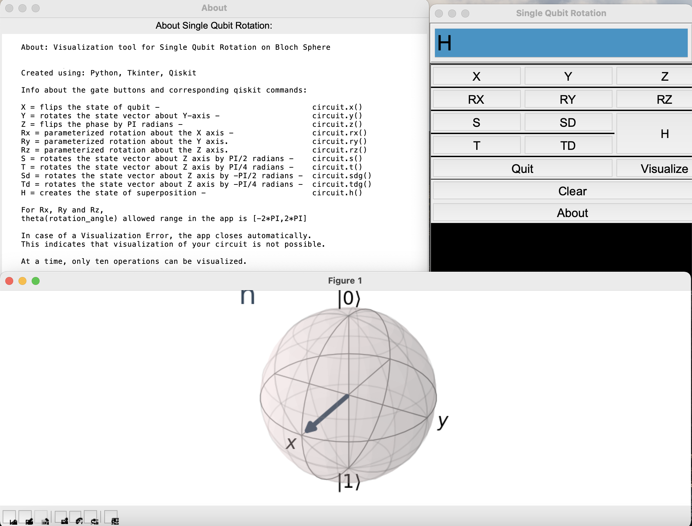

# Single Qubit Rotation Visualizer
A user-friendly visualization tool that facilitates the exploration of single-qubit rotations in quantum computing.

## Table of Contents
- [Overview](#overview)
    - [Logic](#logic)
- [Features](#features)
- [How It Works](#how-it-works)
    - [Built With](#built-with)
    - [Installation Steps](#installation-steps)
- [Usage](#usage)
- [Visual](#visual)

## Overview

Single Qubit Rotation Visualizer allows users to apply various quantum gates, visualize rotations, and gain insights into fundamental quantum computing concepts. With an intuitive interface, users can experiment with parameterized rotation gates, understand gate operations, and observe the corresponding changes on the Bloch Sphere.

### Logic
This project outlines a Tkinter-based GUI application for visualizing single-qubit rotations on the Bloch Sphere using Qiskit. The program initializes a quantum circuit with a single qubit and sets up a graphical interface with buttons representing quantum gates. Each button is associated with a specific gate operation. User interactions trigger the application of corresponding gates to the quantum circuit, and the applied operations are displayed in the GUI. Functions are defined to clear the display, obtain user input for rotation angles, and visualize the quantum circuit on the Bloch Sphere. (The algorithm incorporates error handling for potential visualization issues.)

## Features
- Visualize single qubit rotations on the Bloch Sphere.
- Apply various quantum gates, including X, Y, Z, RX, RY, RZ, S, SD, T, TD, and Hadamard.
- Display gate operations in a clear and interactive manner.
- Supports parameterized rotation gates with a user-friendly interface.

## How It Works

### Built With
- [Conda](https://docs.conda.io/projects/conda/en/latest/user-guide/install/index.html) - Open-source, cross-platform, language-agnostic package manager and environment management system.
- Tkinter - Python graphical user interface (GUI) library.
- Qiskit - SDK for working with quantum computers at the level of pulses, circuits, and application modules.
- [Python 3.8.10](https://www.python.org/downloads/release/python-3810/)
  
### Installation Steps
1. Clone the repository:
   ```bash
   git clone https://github.com/catherine-franco/qubit-rotation-visualizer.git
2. Create and activate a Conda virtual enviornment

   **Virtual Environment Setup:** [How to install Conda](https://docs.conda.io/projects/conda/en/latest/user-guide/install/index.html)
   ```bash
    conda create --name qcircuit python=3.8.10
    conda activate qcircuit
    ```
4. Install Tkinter and Qiskit

   Make sure to install Tkinter and Qiskit within the virtual environment.
   ```bash
    conda install tk
    conda install -c conda-forge qiskit
    ```
6. Run the application
   ```bash
    python qcircut.py
    ```

**Note: Ensure that the specified Python version is installed (e.g., Python 3.8.10) to avoid compatibility issues.**

## Usage
1. Launch the application.
2. Use the provided buttons to apply quantum gates.
3. Visualize the single qubit rotations on the Bloch Sphere.
4. Explore parameterized rotation gates with the user input feature.
5. Clear the display or get more information about the project using the provided buttons.

## Visual
 
